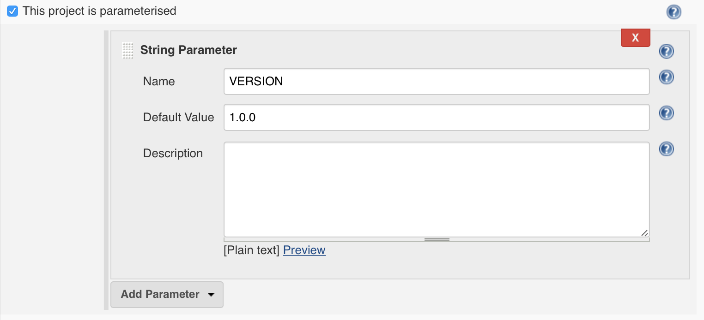
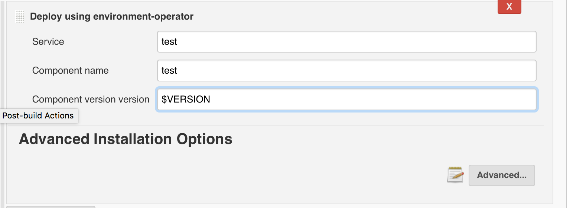

# Environment operator user guide

The purpose of environment operator is to act as an application deployment mechanism to a given environment. This largely equates to a Kubernetes namespace. Each of your environments (development, staging, production) will have it's own definition and a separate endpoint to perform deployments.

Each deployment definition is specified through a manifest file (we refer to as environments.bitesize).  The options/syntax available within an environments bitesize file are detailed in the [Environment Configuration](./Environment_Config.md).    Each environment operator maintains a single environment and takes a predefined section from `environments.bitesize` file to action on. For example, your dev cluster's namespace will have environment-operator configured to watch for changes in  "development" section of your `environments.bitesize`, in your own git repository. It will automatically apply changes such as number of application instances running, load balancer endpoint configuration or environment variables passed to your application.

Other integral part of environment-operator is to provide endpoints to manage your deployments. The most common of them are `/deploy` and `/status/${service}` endpoints.


## Deploying your application manually

You can use `curl` to perform deployments to your environment manually. All you need is to have an application endpoint and [authentication setup](https://github.com/pearsontechnology/environment-operator/blob/dev/Operatonal_Guide.md) when environment-operator was deployed:

```
$ curl -k -XPOST \
       -H "Authentication: Bearer ${auth_token}" \
       -H 'Content-Type: application/json' \
       -d '{"application":"myapp", "name":"myapp", "version":"1.0.0"}' \
       https://${deployment_endpoint}/deploy
```

POST body takes three parameters:
  * *name* - Service you are deploying to. This must match a service name in your `environments.bitesize`
  * *application* - Name of your application image (docker image name, without registry part). In most use cases, it will be the same as *name* option.
  * *version* - Your application's version (docker image tag).

## Get Environment Operator Status of Deployment

To verify if your deployment is complete and running healthy, you can perform GET request against `/status` endpoint:

```
$ curl -k -XGET \
       -H "Authentication: Bearer ${auth_token}" \
       -H "Content-Type: application/json" \
       https://${deployment_endpoint}/status
```

And then check for `"status":"green"` field.

The status endpoint also provides the ability to retrieve status for each pod that is part of your deployed services

```
$ curl -k -XGET \
       -H "Authentication: Bearer ${auth_token}" \
       -H "Content-Type: application/json" \
       https://${deployment_endpoint}/status/${service}/pods
```

The /status/${service}/pods endpoint provides a json array of pods that are deployed as a part of your environment.  The pod information returned is as follows:

```
	Name       - Pod Name
	Phase      - Pod Phase (i.e. Pending, Running, Succeeded, Failed, Unknown)
	StartTime  - Time of day the pod was started
	Message    - Error Message if there are any errors encountered when retrieving pod logs
	Logs       - Tail of the Pod log and is capped at the last 500 lines of the pods log
```

As an example, if your environment.bitesize contains the following two deployments will be made within kubernetes (back and front).

```
project: sample-app
environments:
  - name: dev
    namespace: sample-app
    deployment:
      method: rolling-upgrade
    services:
      - name: front
        external_url: front.sample-app.prsn-dev.io
        ssl: false
        port: 80
      - name: back
        external_url: back.sample-app.prsn-dev.io
        ssl: false
        port: 80
```

Running the following command will return all pods associated with the "front" deployment service

```
$ curl -k -XGET \
       -H "Authentication: Bearer ${auth_token}" \
       -H "Content-Type: application/json" \
       https://${deployment_endpoint}/status/front/pods
```

Likewise, the following command will return all pods associated with the "back" deployment service
```
$ curl -k -XGET \
       -H "Authentication: Bearer ${auth_token}" \
       -H "Content-Type: application/json" \
       https://${deployment_endpoint}/status/back/pods

```
## Installing Jenkins plugin for environment operator

We provide a Jenkins plugin to integrate deployments into your Jenkins pipeline seamlessly. To install plugin please upload hpi file provided at [environment-operator-jenkins-plugin](https://github.com/pearsontechnology/environment-operator-jenkins-plugin/tree/master/plugin) to Jenkins:

    Manage Jenkins -> Manage Plugins -> Advanced -> Upload Plugin


Once plugin is installed, you can use it as a build step in your Jenkins Jobs:


Fields you will need to configure are similar to the parameters you need to specify to curl command. Make sure you specify Endpoint URL (be sure to include http:// on the URL) and Authentication Token in advanced options.

Name, application and version fields can be parameterized inputs. You can parameterize one or all of them, based on your pipeline needs. The following example uses name and application fields as a static inputs, and just uses VERSION as parameter:



Then it could be used in build step settings:



Build step will either fail or succeed based on deployment status.

## Using deployment plugin with Job DSL

If you are using Job DSL to automate your Jenkins configuration, you can configure deployment plugin using native Job DSL support, provided by the plugin. Below is an example build job definition:


```
job('deploy-test-app-to-dev') {
 parameters {
    stringParam('TEST_APP_VERSION', "1.0.0", "test-app application version to deploy")
  }

  steps {
    deploy_to_environment {
      endpoint    'https://deploy.dev.project.prsn.io'
      token       'xxx-xxx-xx-xx'
      service     'test-app'
      application 'test-app'
      version     '$TEST_APP_VERSION'
    }
  }
}
```

